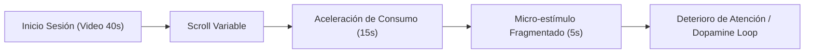
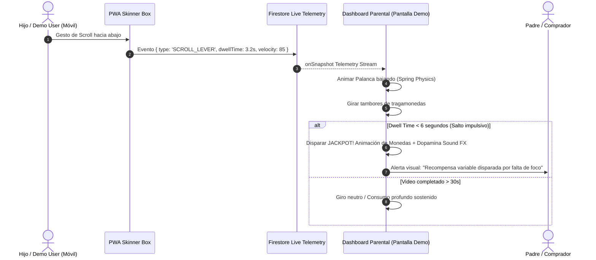

# Documento Técnico: Factor WOW en Demostración Comercial y Parental Dashboard
**Ecosistema:** Zentry Commercial Demo Suite (`demo-features`)  
**Módulos Afectados:** `apps/skinner-box`, `apps/parent-dashboard`, `packages/shared`  
**Fuente de Especificación:** Narración directa de visión y arquitectura de producto (`narracion de mejoras.ogg`)  

---

## 1. Visión Estratégica: El Factor WOW en Ventas y Desarrollo

### 1.1 Objetivo del Documento
El objetivo central de esta especificación es elevar el impacto comercial de la suite de demostración interactiva de Zentry, unificando la ingeniería de software en tiempo real con la narrativa de ventas. La suite no debe limitarse a graficar métricas abstractas; debe **hacer visible y visceral la problemática del diseño adictivo digital** ante el cliente (padres, directores educativos y evaluadores comerciales) y, al mismo tiempo, **evidenciar la solución y beneficio protector** que ofrece Zentry.

> [!NOTE]
> **Fragmento Literal del Autor [00:00 - 00:47]:**  
> *"Voy a narrar las cuestiones que deben considerarse para crear el factor WOW en las diferentes versiones de las features y todo lo necesario relacionado a cómo crear efectos WOW, tanto a nivel de desarrollo como también complementándolo con el área de ventas, ¿no? Entonces eso es sumamente importante relacionarlo de manera directa para que la experiencia de la demostración sea impactante. El objetivo es generar impacto..."*

### 1.2 Premisa de Diseño: Partir de la Problemática Real
Toda demostración comercial efectiva debe originarse en el dolor real del usuario. En la experiencia de Zentry, ese dolor es el secuestro de la atención mediante interfaces diseñadas bajo el condicionamiento operante.

> [!NOTE]
> **Fragmento Literal del Autor [00:56 - 01:19]:**  
> *"...el objetivo es generar impacto y para crear esas experiencias de impacto hay que partir primero de las problemáticas. Entonces nosotros estamos abordando en la demostración una serie de problemáticas que van desde el doomscrolling, o sea, el scrolling excesivo..."*

---

## 2. Problemática Base: Doomscrolling y la Caja de Skinner

### 2.1 El Mecanismo de Decaimiento Temporal de la Atención
Las plataformas de micro-videos (formato TikTok / Reels / Shorts) operan como cámaras de condicionamiento operante modernas (Cajas de Skinner). El usuario inicia con la expectativa de ver contenidos de 40 segundos, pero los algoritmos de recomendación reducen progresivamente la duración y profundidad del contenido consumido, habituando al cerebro a estímulos ultra-cortos de 5 a 10 segundos y deteriorando la capacidad de concentración sostenida.



> [!NOTE]
> **Fragmento Literal del Autor [01:22 - 02:21]:**  
> *"...es una problemática que además buscamos demostrar a través de la caja de Skinner. La caja de Skinner es básicamente esta prueba de cómo alguien, cualquiera, puede ser adulto o un niño, que empieza consumiendo bajo el formato de diseño de TikTok, contenidos cortos y demás, empiezan o pueden tener alternativas de visualización de videos de 40 segundos y el sistema los va llevando a videos más cortos, lo que genera problemas de atención. Esa es una problemática que nosotros redactamos y demostramos con la caja de Skinner."*

---

## 3. Módulo 1: Factor WOW #1 — Vista Tragamonedas / Máquina de Casino en Tiempo Real

### 3.1 Dualidad de Vistas en el Dashboard Parental
Actualmente, la sección `SkinnerBoxWidget` en el Dashboard Parental (`apps/parent-dashboard`) expone tacómetros, odómetros de scroll y gráficos analíticos. Aunque funcional para análisis técnico, carece del componente lúdico inmediato que convence visualmente en un pitch comercial de 30 segundos.

Se define formalmente una **arquitectura de doble vista** conmutables mediante pestañas (`ToggleView`):
1. **Vista Analítica (Existente):** Gráficos temporales, retención porcentual, tacómetro RPM de scroll y odómetro numérico.
2. **Vista Máquina de Casino (Nueva):** Interfaz esqueumórfica/vectorial de máquina tragamonedas (*slot machine*) interactiva en código Canvas/SVG/CSS 3D.

> [!NOTE]
> **Fragmento Literal del Autor [02:21 - 03:29]:**  
> *"Entonces el factor wow es que la persona, el usuario y que el padre pueda visualizar en tiempo real cómo funciona esto, cómo funciona y lo pueda ver de una manera bastante entendible. Entonces creo que en la sección del dashboard parental que muestra la caja de Skinner y muestra una serie de gráficos, esa parte está bien, esa debe ser una vista digamos, esa vista es como la vista de métricas. Sin embargo, debe haber otra vista de esa misma sección y esta otra vista debe ser más simple de entender. Podría ser una vista de una máquina de juegos, digamos, o de una máquina de casino simulada hecha en código y que esté directamente conectada con el movimiento que hace el usuario..."*

### 3.2 Sincronización Reactiva Multi-Dispositivo
La máquina de casino en el Dashboard Parental reacciona con latencia $<100\text{ms}$ a los gestos que el sujeto de prueba ejecuta en la PWA `apps/skinner-box` (ejecutándose en un teléfono móvil o en una ventana secundaria de demostración).



> [!NOTE]
> **Fragmento Literal del Autor [03:29 - 05:06]:**  
> *"...y que cuando esté viendo contenido muy corto o cuando permanezca poco tiempo en un contenido, eso sea como un jackpot o una animación de ese tipo como de ganó algo. Entonces ese ciclo de dopamina y ese ciclo de recompensa debería estar bien medida y debe mostrarse al mismo tiempo en tiempo real lo que está haciendo el usuario que tiene el enlace de la Skinner Box y lo que está viendo el padre en el parental dashboard en la sección de Skinner... Entonces debe mostrarse cuando la persona hace scroll, debe mostrarse cómo la palanca baja al mismo tiempo. Cuando la persona permanece poco tiempo en un video y hace scroll, se debe mostrar como que ganó algo... Entonces ese es el primer factor wow. Ese es un momento en el que la persona ve cómo el scrolling tiene mucho que ver con las máquinas de casino."*

### 3.3 Matriz de Eventos y Comportamiento Visual del Tragamonedas

| Evento en `skinner-box` | Condición Algorítmica | Animación en Tragamonedas (`parent-dashboard`) | Significado Pedagógico / Comercial |
| :--- | :--- | :--- | :--- |
| **Scroll Rápido (Swipe)** | $\Delta t < 500\text{ms}$ entre scrolls | La palanca mecánica lateral se jala violentamente hacia abajo con rebote amortiguado. | Reflejo involuntario del pulgar imitando la palanca del casino. |
| **Micro-permanencia (Skip impulsivo)** | Tiempo en video $< 6\text{s}$ | Los rodillos giran y se detienen en combinación brillante (**7-7-7 / Cherry**). Efecto **JACKPOT**: explosión de confeti/chispas lavanda y sonido de monedas. | Representación gráfica del *dopamine hit*: el cerebro premia la novedad rápida. |
| **Visualización sostenida** | Tiempo en video $> 25\text{s}$ o video completo | Rodillos giran en desaceleración suave, deteniéndose en iconos de enfoque/libro verde neutro. | Enfoque constructivo: no hay adicción al salto rápido. |
| **Tasa de Scroll Frecuente (VR-7)** | 7º scroll consecutivo | Alarma de iluminación perimetral parpadeante en púrpura Zentry. | Refuerzo de razón variable (*Variable-Ratio Schedule*). |

---

## 4. Módulo 2: Factor WOW #2 — Subsección de Reporte de Sesión y Salud de Consumo

### 4.1 Ciclo de Vida de la Sesión y Persistencia en Backend
El factor WOW no termina en alertar el peligro; debe entregar certidumbre y control parental tangible. Para ello, se introduce una **Subsección de Reporte de Sesión** que se materializa automáticamente cuando el usuario culmina su navegación en la PWA.

```
[Inicio de Sesión en skinner-box]
       │
       ▼  (Registro de interacciones, dwell times, tags temáticos)
[Fin de Sesión: Timeout o Botón Terminar]
       │
       ▼  (Compilación de agregados y métricas)
[Escritura Firestore en /sessions_skinner/{sessionId}]
       │
       ▼  (Disparo en Dashboard Parental)
[Generación de Tarjeta de Reporte de Diagnóstico de Salud de Consumo]
```

> [!NOTE]
> **Fragmento Literal del Autor [05:06 - 06:39]:**  
> *"Ahora, no solo debe mostrar la problemática, sino que también el beneficio que le da nuestra herramienta al padre. Entonces, en esa misma sección de Skinner Box debería haber otra vista, que más que otra vista sería como una sección, una subsección, una subsección de reporte. Entonces, cuando acaba la sesión —la sesión empieza cuando el usuario empieza a hacer el scrolling en la otra web app y la sesión empieza y tiene un fin—, entonces cada sesión debería tener un registro en el backend y esa sesión debe registrarse lo que ocurrió en esa sesión. Al momento de acabar una sesión, debería crearse un reporte. Entonces cuando tú entras a esa parte de reporte debería mostrarte cómo, según el consumo, cómo es de saludable ese consumo digamos."*

### 4.2 Algoritmo del Índice de Salud de Consumo ($I_{sc}$)
El índice de salud de consumo evalúa la proporción entre el tiempo de atención profunda frente a la fragmentación impulsiva:

$$I_{sc} = \left( \frac{\text{Tiempo Total Enfocado}}{\text{Duración Total de la Sesión}} \right) \times \left( 1 - \frac{\text{Skips Rápidos (< 6s)}}{\text{Total de Videos Visualizados}} \right) \times 100$$

> [!NOTE]
> **Fragmento Literal del Autor [06:39 - 07:03]:**  
> *"Entonces si en 5 minutos o 10 minutos el chico estuvo viendo contenidos solamente de 5 segundos, tuvo una permanencia muy baja en el contenido y muy poca atención, estamos hablando de un contenido menos saludable frente a uno que termina los videos y permanece más en cada contenido."*

### 4.3 Visualización Cromática: Gradiente Continuo (Rojo a Verde)
En lugar de una métrica fría, la subsección de reporte despliega una barra de rango cromático continuo:

```
[ ROJO: Crítico / Adictivo ] <─────── [ ÁMBAR: Mixto ] ───────> [ VERDE: Saludable / Enfoque ]
        0% - 39%                           40% - 69%                       70% - 100%
  Permanencia < 6s                   Permanencia ~15s                Videos completados
  Atención fragmentada              Atención intermedia              Foco sostenido
```

> [!NOTE]
> **Fragmento Literal del Autor [07:03 - 07:27]:**  
> *"Entonces debe haber también una visualización en esa sección del reporte, cómo en qué rango de, o sea qué tan saludable es la persona. Entonces debería haber como esas barras, como esas barras tendiendo de verde a rojo, y a medida que están más cercanos al verde, pues es un consumo más saludable que tendiendo a rojo..."*

---

## 5. Módulo 3: Motor de Recomendaciones Inteligentes Basado en Intereses y Papers Científicos

### 5.1 Recomendaciones Offline del Mundo Real
El reporte no diagnostica pasivamente: prescribe acciones parentales enriquecedoras. A partir de los metadatos y categorías de los videos consumidos durante la sesión (por ejemplo, animales, astronomía, robótica, arte), el sistema sugiere experiencias físicas fuera de pantalla.

> [!NOTE]
> **Fragmento Literal del Autor [07:28 - 08:14]:**  
> *"...dependiendo del punto en el que esté esa barra, esa sección de reportes podría generar una serie de recomendaciones. Entonces esa serie de recomendaciones también debería estar basada en el tipo de contenido que se ha consumido. Entonces si a la persona le interesan ciertos temas, de repente el sistema puede recomendar hacer acciones como... por ejemplo si se determina que le gustan los animales, llevarlo a un zoológico, y cosas por el estilo que ayuden al padre a dar recomendaciones basadas en sus intereses."*

### 5.2 Sustento y Rigor Científico (Papers Indexados)
Para conferir máxima autoridad ante instituciones y familias exigentes, cada recomendación y diagnóstico debe estar respaldado por bibliografía neurocientífica y psicológica rigurosa (papers publicados en revistas como *Nature Human Behaviour*, *Pediatrics* o *Journal of Attention Disorders*).

> [!NOTE]
> **Fragmento Literal del Autor [08:14 - 08:38]:**  
> *"Ahora, lógicamente estas investigaciones y estas conclusiones de los reportes deberían ser generadas en base a contenido que haya consumido y debería ser también generada en base a papers científicos y a cosas que tengan fundamento científico para que no sean cosas que no tengan sentido."*

### 5.3 Mapeo de Diagnósticos, Recomendaciones y Respaldos Científicos

| Nivel de Salud de Consumo | Interés Detectado en Sesión | Recomendación Práctica para el Padre | Fundamento & Paper Científico de Respaldo |
| :--- | :--- | :--- | :--- |
| **Bajo (Rojo: $I_{sc} < 40\%$)** | Naturaleza / Animales y Biodiversidad | **Actividad Offline Inmediata:** Desconexión digital guiada y visita de campo a zoológico interactivo o reserva botánica. | *Attention Restoration Theory (ART)*: Kaplan, S. (1995). *"The restorative benefits of nature: Toward an integrative framework." Journal of Environmental Psychology*. Demuestra que el contacto con entornos vivos recupera los mecanismos de atención sostenida agotados por pantallas. |
| **Bajo (Rojo: $I_{sc} < 40\%$)** | Videojuegos / Dinámicas de Velocidad | **Actividad Offline:** Deportes de coordinación oculomanual (escalada, tenis de mesa o juegos de mesa estratégicos). | Small, G. W., et al. (2020). *"Brain health consequences of digital technology use." Dialogues in Clinical Neuroscience*. Fundamenta el reemplazo de circuitos de recompensa rápida por dopamina vinculada a metas físicas. |
| **Medio (Ámbar: $40\% \le I_{sc} < 70\%$)** | Ciencia y Experimentos | **Actividad Guiada:** Proponer un kit de experimentos químicos caseros o visita a museo de ciencia interactiva. | Zimmerman, B. J. (2002). *"Becoming a self-regulated learner: An overview." Theory Into Practice*. Transición de la curiosidad pasiva estimulada por video a la agencia activa del aprendizaje. |
| **Alto (Verde: $I_{sc} \ge 70\%$)** | Arte / Narrativa Creativa | **Actividad:** Fomentar dibujo en lienzo físico o redacción de cuentos ilustrados sin pantallas. | Christakis, D. A. (2019). *"The Media Continuum: Rethinking Child Media and Technology." JAMA Pediatrics*. Correlaciona la visualización deliberada y profunda de medios con una preservación óptima de las funciones ejecutivas infantiles. |

---

## 6. Arquitectura Técnica y Especificación de Datos

### 6.1 Extensión de Modelos de Datos (`packages/shared/src/types/skinner.ts`)
Para habilitar la máquina de casino en tiempo real y el reporte post-sesión, se extienden las interfaces de Firestore:

```typescript
// Extensión para Eventos en Vivo de la Máquina de Juegos
export interface SkinnerLiveAction {
  sessionId: string;
  timestamp: number;
  action: 'LEVER_PULL' | 'JACKPOT_HIT' | 'DWELL_ALERT' | 'NORMAL_ADVANCE';
  videoDurationTarget: number; // e.g. 40s -> 5s
  actualDwellSeconds: number;
  scrollVelocityRpm: number;
  leverForceRatio: number;    // 0.0 a 1.0 para física de la palanca
  isVariableRatioReward: boolean;
}

// Extensión del Reporte de Diagnóstico de la Sesión
export interface SkinnerSessionReport {
  sessionId: string;
  childId: string;
  startTime: number;
  endTime: number;
  totalDurationSeconds: number;
  totalVideosCount: number;
  rapidSkipsCount: number;      // Videos vistos < 6 segundos
  completedVideosCount: number;  // Videos vistos > 80%
  healthScore: number;          // 0 a 100 (Escala Rojo a Verde)
  healthColorCategory: 'RED' | 'AMBER' | 'GREEN';
  dominantCategories: Array<{
    category: string;
    dwellSeconds: number;
    interestAffinityPercent: number;
  }>;
  prescriptions: Array<{
    title: string;
    offlineAction: string;
    rationale: string;
    scientificCitation: {
      authors: string;
      year: number;
      paperTitle: string;
      journal: string;
      doiOrReference: string;
    };
  }>;
}
```

### 6.2 Componentes Frontend a Desarrollar / Extender

1. **`SlotMachineViewer.tsx` (`apps/parent-dashboard/src/components/skinner/`):**
   - Chasis gráfico de máquina tragamonedas Zentry (Púrpura `#533B87` y bordes de cristal líquido specular).
   - Palanca física animada por CSS Transform 3D conectada vía `onSnapshot` a `leverForceRatio`.
   - 3 Rodillos SVG con iconos temáticos (TikTok, Alarma, Moneda de Oro Dopamina, Cerebro Alerta, Zentry Shield).
   - Motor de partículas de Jackpot para micro-permanencias ($<6\text{s}$).

2. **`SessionHealthReport.tsx` (`apps/parent-dashboard/src/components/skinner/`):**
   - Barra de gradiente continuo SVG (de `#EF4444` Rojo a `#10B981` Verde Zentry) con puntero indicador animado por resorte.
   - Desglose de métricas: Tiempo Promedio de Atención vs Tasa de Impulsividad.
   - Tarjetas de Recomendaciones Proactivas con botón *badge* expandible: **"Ver Fundamento Científico (Paper)"**.

---

## 7. Roadmap de Implementación Recomendado

| Fase | Tarea Principal | Componente / Archivo | Entregable Clave |
| :--- | :--- | :--- | :--- |
| **Fase 1** | Modelado de Datos y Disparador de Sesión | `packages/shared/src/types/skinner.ts`, `apps/skinner-box/src/services/` | Telemetría de `LEVER_PULL` y cierre formal de sesión con cálculo de $I_{sc}$. |
| **Fase 2** | UI Tragamonedas (Vista Casino) | `apps/parent-dashboard/src/components/skinner/SlotMachineView.tsx` | Palanca reactiva 60fps sincronizada con scroll y animación de Jackpot al saltar videos. |
| **Fase 3** | UI Subsección de Reporte Parental | `apps/parent-dashboard/src/components/skinner/SessionReportView.tsx` | Barra de gradiente Rojo-Verde, métricas de atención y persistencia en Firestore. |
| **Fase 4** | Motor de Recomendaciones y Papers | `packages/shared/src/constants/scientificPapers.ts` | Base curada de papers científicos vinculados dinámicamente a las categorías de consumo. |
| **Fase 5** | Conmutador de Vistas en Dashboard | `apps/parent-dashboard/src/components/skinner/SkinnerContainer.tsx` | Selector Pestañas: *Vista Analítica* vs *Vista Lúdica Casino* vs *Reporte Final*. |

---

## 8. Conclusión de Valor Comercial
Al incorporar estas mejoras nacidas de la visión directa de la narración, la demostración de Zentry logra:
1. **Impacto Emocional Inmediato:** El padre o evaluador no ve una gráfica aburrida; ve en vivo una **máquina de casino tragamonedas operando a costa de la atención de su hijo**.
2. **Claridad Pedagógica:** La palanca bajando simultáneamente con el dedo del usuario desmitifica la inocencia de los algoritmos de micro-video.
3. **Solución y Confianza:** El reporte con gradiente cromático y recomendaciones respaldadas en ciencia médica posiciona a Zentry no como un castigador, sino como un aliado protector de la neuroplasticidad familiar.
