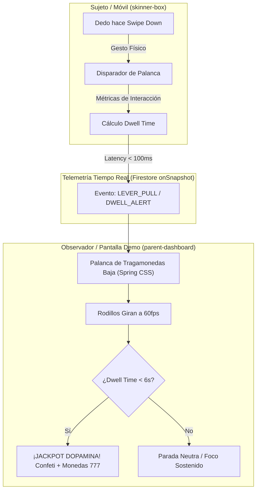

# Neurobiología del Condicionamiento Operante y Mecánicas de Tragamonedas en Feeds de Micro-Video

## 1. Resumen Ejecutivo
Este documento proporciona la base teórica y neurobiológica necesaria para que un agente de software implemente la **Vista de Máquina de Casino (Tragamonedas / Slot Machine)** en el Dashboard Parental de Zentry y calibre el motor de decaimiento en la PWA Skinner Box. 

El modelo de micro-videos de desplazamiento infinito (estilo TikTok / Instagram Reels) implementa de manera estricta una **cámara de condicionamiento operante (Caja de Skinner)** basada en un **programa de refuerzo de razón variable (Variable-Ratio Schedule o VR)**. Cada acción de desplazamiento (*scroll*) equivale mecánicamente a presionar una palanca de tragamonedas (*one-armed bandit*). La recompensa no está garantizada en cada tirada, sino distribuida de forma probabilística e impredecible, lo cual maximiza la tasa de respuesta conductual, retrasa la extinción y activa descargas fásicas de dopamina en el Área Tegmental Ventral (VTA) y el cuerpo estriado (*striatum*).

---

## 2. Análisis Arquitectónico y Técnico

### 2.1 El Circuito Neurobiológico de la Recompensa y el Error de Predicción (RPE)
El neurobiólogo Wolfram Schultz (PNAS 2024; Nature 1997) formuló el principio del **Reward Prediction Error (RPE)** en las neuronas dopaminérgicas:

$$\delta(t) = R(t) + \gamma V(S_{t+1}) - V(S_t)$$

Donde:
- $\delta(t)$: Señal de error fásica de dopamina en el tiempo $t$.
- $R(t)$: Recompensa inmediata recibida (calidad/novedad del video).
- $V(S_t)$: Valor esperado o predicción del estado actual.
- $\gamma$: Factor de descuento temporal.

Cuando un usuario hace *scroll*:
1. **Resultado Inesperado Superior ($\delta > 0$):** Un video altamente gratificante produce una descarga dopaminérgica masiva en el cuerpo estriado ventral (núcleo accumbens).
2. **Resultado Neutro o Aburrido ($\delta \le 0$):** No extingue la conducta; induce un impulso inmediato de volver a tirar de la palanca (*scroll*) para buscar la próxima recompensa fásica.

Estudios con resonancia magnética funcional (fMRI) específicos sobre el algoritmo de recomendación de TikTok (Su et al., *NeuroImage* 2021; He et al., *Frontiers in Human Neuroscience* 2026) confirman que los videos personalizados activan selectivamente el Área Tegmental Ventral (VTA) y modulan la red en modo por defecto (Default Mode Network - DMN), reduciendo la conectividad en las redes de control atencional ejecutivo.

### 2.2 Mapeo Operante: Del Algoritmo de TikTok al Tragamonedas Zentry
Para la demostración comercial, Zentry transforma visualmente esta analogía psicológica abstracta en una máquina física interactiva dentro de `parent-dashboard`:



### 2.3 Especificación del Motor de Razón Variable (VR-7)
En el código de `apps/skinner-box`, la recompensa variable está calibrada con una distribución de Poisson centrada en $k = 7$ interacciones (VR-7):

```typescript
// Implementación recomendada para packages/shared/src/algorithms/variableRatio.ts
export interface LeverPullFeedback {
  isJackpot: boolean;
  dopaminePulseLevel: 'LOW' | 'MEDIUM' | 'HIGH' | 'CRITICAL_JACKPOT';
  soundFx: 'click' | 'lever_drop' | 'wheel_spin' | 'jackpot_alarm';
  reelIcons: [string, string, string];
}

export function evaluateSlotMachineEvent(
  consecutiveScrolls: number,
  dwellTimeSeconds: number,
  targetDurationSeconds: number
): LeverPullFeedback {
  // Condición 1: Salto impulsivo prematuro (< 6s) activa recompensa artificial de dopamina
  if (dwellTimeSeconds < 6.0) {
    return {
      isJackpot: true,
      dopaminePulseLevel: 'CRITICAL_JACKPOT',
      soundFx: 'jackpot_alarm',
      reelIcons: ['🎰', '💎', '🔥']
    };
  }

  // Condición 2: Programa de Razón Variable VR-7
  const isVrTrigger = consecutiveScrolls % 7 === 0 || Math.random() < 0.1428;
  if (isVrTrigger) {
    return {
      isJackpot: true,
      dopaminePulseLevel: 'HIGH',
      soundFx: 'wheel_spin',
      reelIcons: ['⚡', '⚡', '⚡']
    };
  }

  // Condición 3: Progreso normal
  return {
    isJackpot: false,
    dopaminePulseLevel: 'LOW',
    soundFx: 'lever_drop',
    reelIcons: ['📖', '⏳', '💡']
  };
}
```

---

## 3. Matriz Comparativa y Benchmarks

| Parámetro Conductual | Caja de Skinner Clásica (Palomas/Ratas) | Máquina Tragamonedas (Casino Físico) | Feed TikTok / Shorts (Micro-video) | Simulación Zentry (`skinner-box` $\to$ `parent-dashboard`) |
| :--- | :--- | :--- | :--- | :--- |
| **Acción Operante** | Picoteo o presión de palanca con pata. | Desplazamiento manual de palanca lateral. | Gesto de deslizamiento vertical con pulgar (*swipe*). | Deslizamiento táctil con odómetro sincronizado en tiempo real. |
| **Tiempo de Ciclo** | $1.5\text{s} - 4.0\text{s}$. | $3.0\text{s} - 5.0\text{s}$ por giro. | $2.0\text{s} - 8.0\text{s}$ en micro-clips. | Decaimiento temporal forzado de $45\text{s} \to 5\text{s}$. |
| **Programa de Refuerzo** | Razón Variable (VR-15). | Razón Variable (VR-20 a VR-50). | Razón Variable algorítmica impulsada por IA (VR-5 a VR-10). | Razón Variable matemática (VR-7) con jackpots ante *skips*. |
| **Señal de Recompensa** | Píldora de alimento o agua. | Sonido de monedas, luces intermitentes, créditos. | Estimulación audiovisual novedosa (humor, shock, música). | Animación CSS/Canvas de rodillos, campanilla y confeti lavanda. |
| **Latencia de Respuesta** | Inmediata ($<500\text{ms}$). | Inmediata ($<200\text{ms}$). | Streaming continuo ($<300\text{ms}$). | Sincronización Firestore `onSnapshot` ($<100\text{ms}$). |

---

## 4. Limitaciones, Riesgos y Consideraciones Técnicas
1. **Latencia de Sincronización Multi-Dispositivo:** Durante la demo de ventas, el padre y el hijo pueden estar en dispositivos conectados a redes distintas (ej. WiFi vs 5G). Para evitar desincronización en la animación de la palanca, `parent-dashboard` debe usar timestamps de alta precisión (`performance.now()` relativo) y aplicar interpolación lineal para animar el resorte si el ping excede los $150\text{ms}$.
2. **Sensibilidad Ética y Pedagógica:** La metáfora del casino es de alto impacto emocional para los padres. La UI debe acompañar el *jackpot* con etiquetas explicativas claras (ej. *"Ciclo de recompensa fásica disparado por micro-permanencia"*), evitando que el observador piense que la plataforma fomenta las apuestas, sino que diagnostica la adicción algorítmica.

---

## 5. Referencias y Fuentes Consultadas
1. **Schultz, W. (2024).** *A dopamine mechanism for reward maximization.* Proceedings of the National Academy of Sciences (PNAS), 121(20), e2316658121. DOI: [10.1073/pnas.2316658121](https://doi.org/10.1073/pnas.2316658121). PMID: [38717856](https://pubmed.ncbi.nlm.nih.gov/38717856/).
2. **Su, C., Zhou, H., Gong, L., Teng, B., Geng, F., & Hu, Y. (2021).** *Viewing personalized video clips recommended by TikTok activates default mode network and ventral tegmental area.* NeuroImage, 237, 118136. DOI: [10.1016/j.neuroimage.2021.118136](https://doi.org/10.1016/j.neuroimage.2021.118136). PMID: [33932549](https://pubmed.ncbi.nlm.nih.gov/33932549/).
3. **He, S., Tang, S., & Liu, D. (2026).** *Association between usage intensity of short video platforms and altered brain function: a resting-state functional magnetic resonance imaging study.* Frontiers in Human Neuroscience, 20, 1786568. DOI: [10.3389/fnhum.2026.1786568](https://doi.org/10.3389/fnhum.2026.1786568). PMID: [42253790](https://pubmed.ncbi.nlm.nih.gov/42253790/).
4. **Ferster, C. B., & Skinner, B. F. (1957).** *Schedules of Reinforcement.* New York: Appleton-Century-Crofts.
5. **Montag, C., Lachmann, B., Herrero, M., & Schmitt, H. (2019).** *Addictive Features of Social Media/Messenger Platforms and Freemium Games against the Background of Psychological and Economic Theories.* International Journal of Environmental Research and Public Health, 16(14), 2612. DOI: [10.3390/ijerph16142612](https://doi.org/10.3390/ijerph16142612).
