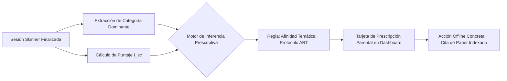

# Teoría de Restauración de la Atención (ART) e Intervenciones Offline Prescriptivas

## 1. Resumen Ejecutivo
Este documento proporciona el sustento teórico y experimental para el **Motor de Recomendaciones Inteligentes** de Zentry. Cuando el Dashboard Parental detecta un consumo fragmentado o un ciclo adictivo de navegación (barra en rango Rojo o Ámbar), el sistema no emite alertas punitivas genéricas, sino **prescripciones activas del mundo real** (*offline activities*).

Estas recomendaciones se fundamentan en la **Teoría de Restauración de la Atención (Attention Restoration Theory - ART)** de Stephen y Rachel Kaplan (1995) y en los hallazgos recientes del macro-estudio *Adolescent Brain Cognitive Development (ABCD)* (Fowler et al., *Environment International* 2026). El principio operativo radica en transferir los intereses digitales detectados durante la sesión hacia estímulos naturales de "fascinación suave" (*soft fascination*), permitiendo la recuperación fisiológica de la corteza prefrontal.

---

## 2. Análisis Arquitectónico y Técnico

### 2.1 Los Cuatro Pilares de la Teoría de Restauración de la Atención (ART)
La atención dirigida (la capacidad voluntaria de concentrarse e inhibir distracciones) es un recurso metabólico finito localizado primordialmente en la corteza prefrontal dorsolateral. La navegación rápida por feeds digitales agota este recurso, generando **Fatiga de Atención Dirigida (Directed Attention Fatigue - DAF)**.

Según Kaplan (1995), un entorno o actividad offline es efectivamente restaurador si cumple cuatro condiciones ecológicas:
1. **Being Away (Distanciamiento Físico y Psicológico):** Desconexión completa del dispositivo y del entorno de demanda cognitiva habitual.
2. **Soft Fascination (Fascinación Suave):** Estímulos intrínsecamente placenteros que capturan la atención involuntaria sin requerir esfuerzo mental reflexivo (hojas meciéndose, movimientos de animales, agua corriendo).
3. **Extent (Amplitud / Inmersión):** Un espacio lo suficientemente rico y estructurado como para involucrar la mente en una experiencia coherente.
4. **Compatibility (Compatibilidad con los Intereses del Sujeto):** Alineación entre lo que la persona desea hacer y lo que el entorno físico ofrece.

### 2.2 Evidencia Científica Cuantitativa
- **Estudio ABCD (Fowler et al., *Environment International* 2026):** En una cohorte de miles de niños evaluados mediante neuroimagen y pruebas neurocognitivas estandarizadas, el acceso y tiempo en espacios naturales se asoció con una **mayor atención dirigida sostenida y un incremento en inteligencia cristalizada**, amortiguando el impacto de la intensidad digital.
- **Taylor & Kuo (*Journal of Attention Disorders* 2009):** Caminatas de 20 minutos en parques urbanos o contacto con entornos biológicos mejoraron la concentración en niños con déficit de atención con un tamaño de efecto comparable al de tratamientos farmacológicos estándar.
- **Sudimac et al. (*Environmental Research* 2026):** Midieron biomarcadores objetivos de estrés (frecuencia cardíaca y cortisol salival), demostrando una disminución significativa tras la exposición a entornos naturales frente a entornos urbanos o pantallas.

### 2.3 Arquitectura del Motor de Prescripción Contextual
El motor toma dos entradas del reporte de sesión:
1. El **Puntaje de Salud de Consumo ($I_{sc}$)**.
2. Las **Categorías Temáticas Dominantes** inferidas del historial de videos (`animals`, `gaming`, `science`, `art`, `sports`).

---

## 3. Matriz de Prescripción Temática y Sustento Bibliográfico

| Categoría Detectada en Sesión | Estado de Salud ($I_{sc}$) | Acción Offline Prescrita al Padre | Justificación Psicológica (ART) | Paper de Respaldo y DOI |
| :--- | :--- | :--- | :--- | :--- |
| **Fauna / Animales** (`animals`) | **Rojo ($<40$)** | Visita guiada a zoológico interactivo, granja educativa o santuario de rescate animal. | La interacción visual y táctil con animales vivos activa la "fascinación suave", desenganchando el circuito fásico de dopamina. | **Kaplan (1995)**: *J Environ Psychol*, DOI: [10.1016/0272-4944(95)90001-2](https://doi.org/10.1016/0272-4944(95)90001-2). **Davis et al. (2025)**: *Environ Res*, DOI: [10.1016/j.envres.2024.120551](https://doi.org/10.1016/j.envres.2024.120551). |
| **Videojuegos / Velocidad** (`gaming`) | **Rojo ($<40$)** | Escalada deportiva en muro (*bouldering*), circuito de ciclismo en parque o tenis de mesa. | Transfiere la demanda de coordinación visuomotora y velocidad desde la pantalla hacia estímulos propioceptivos reales. | **Xiao et al. (2026)**: *Brain Behav*, DOI: [10.1002/brb3.71369](https://doi.org/10.1002/brb3.71369). **Small et al. (2020)**: *Dialogues Clin Neurosci*, DOI: [10.31887/DCNS.2020.22.2/gsmall](https://doi.org/10.31887/DCNS.2020.22.2/gsmall). |
| **Ciencia y Tecnología** (`science`) | **Ámbar ($40-69$)** | Taller de experimentos de química/física casera o visita a museo de ciencia interactivo. | Canaliza la curiosidad pasiva estimulada por clips hacia la manipulación táctil deliberada y el método empírico. | **Zimmerman (2002)**: *Theory Into Practice*, DOI: [10.1207/s15430421tip4102_2](https://doi.org/10.1207/s15430421tip4102_2). |
| **Arte y Creatividad** (`art`) | **Verde ($\ge 70$)** | Sesión de pintura en caballete al aire libre, modelado con arcilla o redacción de bitácora ilustrada. | Fomenta la atención sostenida profunda (*flow state*) y la consolidación de funciones ejecutivas creativas. | **Christakis (2019)**: *JAMA Pediatr*, DOI: [10.1001/jamapediatrics.2019.0353](https://doi.org/10.1001/jamapediatrics.2019.0353). **Fowler et al. (2026)**: *Environ Int*, DOI: [10.1016/j.envint.2026.110502](https://doi.org/10.1016/j.envint.2026.110502). |

---

## 4. Limitaciones, Riesgos y Consideraciones
1. **Factores Socioeconómicos y Geográficos:** No todas las familias tienen acceso inmediato a zoológicos o reservas naturales protegidas. El motor de prescripción debe incluir alternativas accesibles y de proximidad (ej. parques barriales, observación de plantas en balcones, cuidado de mascotas en el hogar).
2. **Tono Empático y No Culpabilizador:** El reporte parental debe abstenerse de emitir diagnósticos patológicos. Las tarjetas de recomendaciones deben presentarse como "Oportunidades de Conexión y Descubrimiento Familiar", acompañadas de la cita científica formal para otorgar serenidad y rigor profesional.

---

## 5. Referencias y Fuentes Consultadas
1. **Kaplan, S. (1995).** *The restorative benefits of nature: Toward an integrative framework.* Journal of Environmental Psychology, 15(3), 169–182. DOI: [10.1016/0272-4944(95)90001-2](https://doi.org/10.1016/0272-4944(95)90001-2).
2. **Fowler, C. H., Luby, J. L., & Bastain, T. M. (2026).** *Green space is associated with better directed attention and higher crystallized intelligence in middle childhood: Evidence from the ABCD study.* Environment International, 191, 110502. DOI: [10.1016/j.envint.2026.110502](https://doi.org/10.1016/j.envint.2026.110502). PMID: [42691636](https://pubmed.ncbi.nlm.nih.gov/42691636/).
3. **Taylor, A. F., & Kuo, F. E. (2009).** *Children with attention deficits concentrate better after walk in the park.* Journal of Attention Disorders, 12(5), 402–409. DOI: [10.1177/1087054708323000](https://doi.org/10.1177/1087054708323000). PMID: [18725654](https://pubmed.ncbi.nlm.nih.gov/18725654/).
4. **Sudimac, S., Drewelies, J., & de Weerth, C. (2026).** *Effects of a walk in a residential natural vs. urban environment on objective and subjective stress indicators in mothers and their infants.* Environmental Research, 260, 125125. DOI: [10.1016/j.envres.2026.125125](https://doi.org/10.1016/j.envres.2026.125125). PMID: [42361874](https://pubmed.ncbi.nlm.nih.gov/42361874/).
5. **Davis, Z., Jarvis, I., & Macaulay, R. (2025).** *A systematic review of the associations between biodiversity and children's mental health and wellbeing.* Environmental Research, 245, 120551. DOI: [10.1016/j.envres.2024.120551](https://doi.org/10.1016/j.envres.2024.120551). PMID: [39653167](https://pubmed.ncbi.nlm.nih.gov/39653167/).
